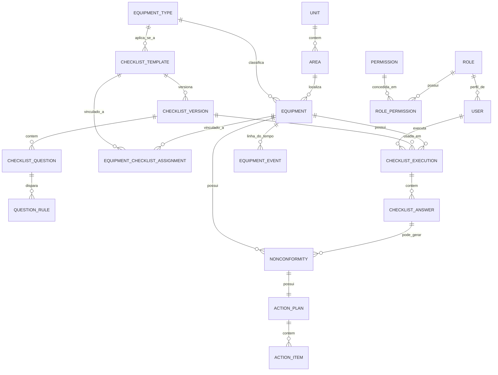
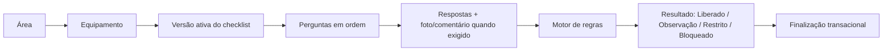

# Sistema de Gestão de Checklists, Inspeções e Equipamentos

Sistema corporativo para gestão do ciclo completo de inspeções de equipamentos:
execução de checklists, identificação de desvios, abertura automática de não
conformidades, bloqueio/liberação de equipamentos, planos de ação, histórico
completo e indicadores gerenciais com drill-down até o registro de origem.

O checklist é apenas a porta de entrada. O sistema existe para dar
rastreabilidade completa à cadeia:

```
CHECKLIST → DESVIO → NÃO CONFORMIDADE → AÇÃO → CORREÇÃO → VALIDAÇÃO → LIBERAÇÃO → HISTÓRICO → INDICADORES
```

## Sumário

- [Stack](#stack)
- [Arquitetura](#arquitetura)
- [Requisitos](#requisitos)
- [Instalação e execução](#instalação-e-execução)
- [Variáveis de ambiente](#variáveis-de-ambiente)
- [Banco de dados e migrations](#banco-de-dados-e-migrations)
- [Dados de demonstração (seed)](#dados-de-demonstração-seed)
- [Usuários de teste](#usuários-de-teste)
- [Autenticação e autorização](#autenticação-e-autorização)
- [Estrutura de pastas](#estrutura-de-pastas)
- [Modelo de dados](#modelo-de-dados)
- [Fluxos principais](#fluxos-principais)
- [Testes](#testes)
- [Build de produção](#build-de-produção)
- [Deploy (produção)](#deploy-produção)
- [Decisões técnicas relevantes](#decisões-técnicas-relevantes)
- [Limitações conhecidas e próxima evolução](#limitações-conhecidas-e-próxima-evolução)

## Stack

| Camada | Tecnologia |
|---|---|
| Framework | Next.js 16 (App Router, Server Components, Server Actions) |
| Linguagem | TypeScript |
| Banco de dados | PostgreSQL (Railway) via Prisma ORM 7 |
| Autenticação | Credenciais próprias (bcrypt + sessão JWT em cookie httpOnly) |
| Validação | Zod (nos Server Actions, antes de qualquer escrita no banco) |
| UI | Tailwind CSS v4 + componentes próprios sobre Radix UI (sem tema padrão de nenhum template) |
| Testes | Vitest (regras de negócio) |
| QR Code | biblioteca `qrcode`, geração local sem serviço externo |

## Arquitetura

Separação por camada (seção 67 do prompt original), não por conveniência de import:

```
src/
  app/                    → Rotas (Next.js App Router) — apenas composição de UI e chamada de services/actions
  components/
    ui/                   → Primitivas de interface (Button, Input, Dialog, Table, ...)
    layout/               → AppShell, navegação lateral consciente de permissões
    domain/                → Componentes de domínio (badges de status, timeline, StatCard, ...)
  domain/
    checklist/             → Motor de regras do checklist e cálculo de agenda/atraso — funções puras, testadas
    shared/                → Catálogo de permissões, controle de acesso puro, geração de códigos amigáveis
  server/
    db.ts                  → Cliente Prisma singleton (driver adapter better-sqlite3)
    auth/                  → Sessão (JWT), hashing de senha, usuário autenticado
    services/               → Regras de negócio + persistência (uma função = uma operação de domínio)
    actions/                → Server Actions: validação (Zod) → chamada ao service → revalidação de cache
  lib/                      → Utilitários (datas em pt-BR, cn(), URL de anexos)
  proxy.ts                  → Proxy (ex-middleware) — verifica sessão + existência/ativação do usuário no banco
prisma/
  schema.prisma             → Modelo de dados completo
  seed.ts                   → Dados de demonstração
```

Regra seguida em todo o projeto: **nenhuma regra de negócio crítica vive em
componentes de UI**. Toda validação relevante é feita no servidor
(`src/server/actions`), nunca apenas no formulário do cliente — inclusive
para usuários mal-intencionados alterando a URL diretamente (seção 52).

O motor de regras do checklist (`src/domain/checklist/rule-engine.ts`) é uma
função pura, sem dependência de banco ou framework, para poder ser testada
isoladamente e para que nenhuma pergunta específica fique "hardcoded" no
código — todo o comportamento crítico vem de dados configurados via admin
(`QuestionRule`).

## Requisitos

- Node.js 20+
- npm
- Um banco PostgreSQL (recomendado: um projeto no [Railway](https://railway.app),
  plano gratuito/baixo custo — crie um banco separado para desenvolvimento e
  outro para produção). Não é necessário instalar Postgres nem Docker
  localmente.

## Instalação e execução

```bash
npm install
cp .env.example .env          # informe a DATABASE_URL do seu banco de dev no Railway
npx prisma migrate deploy     # cria as tabelas a partir das migrations
npx prisma db seed            # popula dados de demonstração
npm run dev                   # http://localhost:3000
```

O `proxy.ts` redireciona `/` para `/login` (ou `/inicio` se já autenticado).

## Variáveis de ambiente

Veja `.env.example`. Resumo:

| Variável | Descrição |
|---|---|
| `DATABASE_URL` | Connection string do Postgres (Railway em dev e em produção — bancos separados). |
| `AUTH_SECRET` | Segredo usado para assinar o cookie de sessão (JWT/HS256). Gere um novo com `node -e "console.log(require('crypto').randomBytes(32).toString('base64'))"`. |
| `STORAGE_DRIVER` | `local` (padrão, disco — usado em dev) ou `blob` (Vercel Blob — usado em produção). |
| `STORAGE_DIR` | Só usado com `STORAGE_DRIVER=local`: diretório onde fotos/anexos são salvos. |
| `BLOB_READ_WRITE_TOKEN` | Só usado com `STORAGE_DRIVER=blob`: gerado automaticamente pelo Vercel ao conectar um Blob Store ao projeto. |

Nenhum segredo fica no código-fonte.

## Banco de dados e migrations

O banco é PostgreSQL, hospedado no Railway (um projeto para desenvolvimento,
outro para produção — ver [Deploy](#deploy-produção)). O driver adapter em
`src/server/db.ts` usa `@prisma/adapter-pg`. Nenhuma regra de negócio
depende do provider — toda a lógica está na camada de `services`, não em SQL
específico do Postgres.

Comandos úteis:

```bash
npx prisma migrate dev --name <nome>   # nova migration em desenvolvimento
npx prisma migrate deploy               # aplica migrations existentes (produção/CI)
npx prisma studio                       # explorar o banco visualmente
```

## Dados de demonstração (seed)

`npx prisma db seed` cria:

- 1 unidade (Unidade Central) e 4 áreas: Recebimento, Armazenagem, Separação, Expedição.
- 4 tipos de equipamento e os equipamentos **PE-001** a **PE-004** (Paleteira Elétrica) na Expedição.
- O modelo de checklist **"Inspeção Diária — Paleteira Elétrica"**, versão 1 publicada, com 8 perguntas — incluindo a pergunta crítica de freio (seção 62 do prompt original): resposta "Não" exige comentário e foto, cria não conformidade e **bloqueia o equipamento automaticamente**.
- 4 usuários de demonstração, um por perfil.
- Catálogo de permissões e a associação padrão de permissões por perfil.

O seed é idempotente (`upsert`): pode ser executado novamente sem duplicar dados.

## Usuários de teste

Senha para todos: **`Demo@123`**

| E-mail | Perfil |
|---|---|
| colaborador@demo.com | Colaborador |
| lider@demo.com | Líder / Supervisor |
| gestor@demo.com | Gestor |
| admin@demo.com | Administrador |

## Autenticação e autorização

- **Sessão**: JWT assinado (HS256) em cookie `httpOnly`, `sameSite=lax`. Sem
  dependência de provedor externo — arquitetura permite trocar por
  OAuth/SSO no futuro sem alterar o restante do sistema (a interface
  `CurrentUser` já abstrai a origem da sessão).
- **Proxy** (`src/proxy.ts`, roda em runtime Node.js): verifica a assinatura
  do JWT **e** confirma no banco que o usuário ainda existe e está ativo,
  antes de liberar qualquer rota protegida. Isso evita que uma sessão válida
  criptograficamente, mas de um usuário desativado, continue acessando o
  sistema.
- **Permissões**: não são amarradas ao nome do perfil no código. Existem
  tabelas `Role`, `Permission` e `RolePermission` — o código sempre verifica
  uma permissão (`PERMISSIONS.EQUIPMENT_MANAGE`, por exemplo), nunca
  `role === "ADMINISTRADOR"`. Isso permite criar novos perfis ou ajustar
  permissões de perfis existentes via banco, sem alterar código (seção 5).
- **Acesso por área**: todo dado operacional (equipamentos, checklists, não
  conformidades) é filtrado pelas áreas do usuário autenticado
  (`requireAreaAccess`), tanto na listagem quanto no acesso direto por ID —
  alterar o ID na URL não contorna a restrição (seção 52).

## Estrutura de pastas

Ver [Arquitetura](#arquitetura) acima para a árvore completa. Dentro de
`src/app/(app)`, cada pasta é um módulo de navegação (`equipamentos`,
`nao-conformidades`, `checklist/realizar`, `cadastros/*`, etc.), protegido
pelo layout comum (`src/app/(app)/layout.tsx`), que monta a navegação lateral
de acordo com as permissões do usuário autenticado.

## Modelo de dados

Diagrama simplificado das entidades centrais (o schema completo está em
`prisma/schema.prisma`, com ~28 modelos):



Pontos de design importantes:

- **Versionamento imutável**: `ChecklistExecution` referencia sempre uma
  `ChecklistVersion` específica, nunca o `ChecklistTemplate` diretamente.
  Publicar uma nova versão nunca altera perguntas de uma versão já usada em
  execuções passadas (seção 17).
- **Enums centralizados** no schema Prisma (`EquipmentStatus`,
  `NonconformityStatus`, `ActionItemStatus`, etc.) — nunca strings soltas
  espalhadas pelo código (seção 22).
- **Sequência atômica** (`Sequence`) para gerar códigos amigáveis
  (`PE-001`, `NC-000001`, `EXE-000001`) mantendo UUID como chave primária
  real (seção 59).

## Fluxos principais

### Execução de checklist



A finalização (`finalizeExecution`) recebe o estado completo de respostas do
cliente (não depende de autosave ter terminado a tempo — seção 57, evita
condição de corrida), valida obrigatoriedade/comentário/foto, e só então
executa em uma única transação: grava o resultado, cria não conformidades
para cada desvio configurado, atualiza o status do equipamento e registra
todos os eventos correspondentes na linha do tempo. Tudo ou nada.

### Desvio crítico → bloqueio → liberação (critério de aceite da seção 74)

```mermaid
flowchart LR
    A[Colaborador responde<br/>pergunta crítica de forma não conforme] --> B[Sistema exige<br/>comentário + foto]
    B --> C[Checklist finalizado]
    C --> D[NC criada automaticamente]
    D --> E[Equipamento bloqueado]
    E --> F[Gestor localiza a ocorrência]
    F --> G[Plano de ação criado]
    G --> H[Responsável conclui a ação]
    H --> I[Usuário autorizado valida]
    I --> J[NC encerrada +<br/>equipamento liberado]
    J --> K[Toda a sequência<br/>fica no histórico]
```



Este fluxo está coberto por teste manual reproduzível: seguir com o usuário
`colaborador@demo.com` até `PE-003`, responder "Não" na pergunta de freio,
depois `lider@demo.com` para criar/concluir a ação e validar a correção.

### Indicadores clicáveis

Todo número na tela de indicadores (`/indicadores`) e na home de gestão
(`/inicio`) é um link para a lista filtrada que originou aquele número —
nunca um gráfico solto (seção 12).

## Testes

```bash
npm run test
```

Cobertura focada em regras de negócio (seção 63), não em componentes visuais:

- `src/domain/checklist/rule-engine.test.ts` — pergunta crítica, cálculo de
  resultado (liberado/observação/restrito/bloqueado), validação de
  obrigatoriedade/comentário/foto, comportamento de "Não aplicável".
- `src/domain/checklist/scheduling.test.ts` — cálculo de ocorrências
  previstas por periodicidade e cálculo de atraso.
- `src/domain/shared/codes.test.ts` — geração de códigos amigáveis.
- `src/domain/shared/access-control.test.ts` — permissões e isolamento de
  acesso por área.

## Build de produção

```bash
npm run lint
npm run build
```

Ambos concluídos sem erros e sem warnings no estado atual do projeto.

## Deploy (produção)

Stack de hospedagem: **Vercel** (app Next.js) + **Railway** (Postgres) +
**Vercel Blob** (fotos/anexos). Passo a passo:

1. **Railway** — criar um projeto e adicionar um serviço "PostgreSQL" (New →
   Database → PostgreSQL). Repita pra ter um banco de **desenvolvimento** e
   outro de **produção**, pra não misturar dado de teste com dado real. Em
   cada um, aba "Connect" tem a `DATABASE_URL` pronta pra copiar.
2. **GitHub** — o projeto precisa estar em um repositório git conectado ao
   Vercel pra ter deploy automático a cada push.
3. **Vercel** — criar um projeto novo importando esse repositório. Em
   **Storage**, criar um **Blob Store** e conectar ao projeto (isso já
   configura a variável `BLOB_READ_WRITE_TOKEN` sozinho). Em **Settings →
   Environment Variables**, adicionar:
   - `DATABASE_URL` — a connection string do banco de **produção** do Railway
   - `AUTH_SECRET` — um valor aleatório novo (não reaproveite o de dev)
   - `STORAGE_DRIVER` — `blob`
4. Rodar as migrations contra o banco de produção antes (ou logo depois) do
   primeiro deploy: `npx prisma migrate deploy` com `DATABASE_URL` apontando
   pro banco de produção do Railway. `npx prisma db seed` é opcional em
   produção (cria os usuários de demonstração — normalmente só útil em dev).
5. O deploy em si acontece automaticamente a cada push pro branch principal.

## Decisões técnicas relevantes

- **Postgres (Railway) desde o início do deploy**: a primeira versão local
  rodava em SQLite pra não ter nenhuma dependência externa durante o
  desenvolvimento inicial; ao hospedar, migramos pra Postgres (schema e
  camada de `services` já tinham sido escritos pra isso — só trocou
  datasource + driver adapter, sem nenhuma regra de negócio dependente do
  provider).
- **Autenticação própria em vez de um provedor externo**: optou-se por uma
  sessão JWT própria em vez de introduzir uma dependência de infraestrutura
  extra de autenticação. A interface `CurrentUser` isola o resto do sistema
  desse detalhe.
- **Armazenamento de fotos**, servido por uma rota autenticada
  (`/api/uploads/[...path]`) em vez de `public/` ou URL pública direta, para
  não expor evidências de não conformidade sem autenticação. Em
  desenvolvimento fica em disco local; em produção (Vercel, sem disco
  persistente) fica no Vercel Blob como objeto **privado** — a rota busca o
  conteúdo no Blob a partir do login autenticado, nunca expõe a URL do Blob
  direto pro navegador. Os dois modos ficam isolados em
  `src/server/services/storage.ts` e na própria rota, escolhidos por
  `STORAGE_DRIVER`.
- **Finalização de checklist recebe o estado completo do cliente**: o
  autosave por pergunta é "best-effort" (permite retomar depois), mas a
  finalização em si envia e persiste todas as respostas atuais antes de
  validar — evita perder uma resposta visível na tela por causa de uma
  requisição de autosave ainda em trânsito.
- **QR Code** gerado localmente (`qrcode`), sem serviço externo — aponta para
  `/q/[token]`, que resolve o equipamento e redireciona para o prontuário.

## Limitações conhecidas e próxima evolução

Documentadas com transparência, não implementadas de forma "fake" (seção 72):

- **Notificações** (checklist atrasado, NC crítica, ação vencida): o modelo
  de dados (`Notification`) já existe, mas o envio real (e-mail/WhatsApp) não
  foi integrado — não há credencial/serviço externo configurado nesta fase.
- **Exportação (CSV/PDF/Excel)**: não implementada nesta versão para não
  comprometer o núcleo do sistema dentro do tempo disponível; os dados já
  estão estruturados para isso ser adicionado depois.
- **Múltiplas regras por pergunta**: o motor de regras aplica uma regra por
  valor de resposta (suficiente para todo o catálogo de perguntas do
  documento original); perguntas de múltipla escolha (múltiplos valores
  selecionados simultaneamente) não disparam regra automaticamente — apenas
  seleção única/fixa.

## Próximos passos sugeridos

1. Adicionar exportação de relatórios (CSV como primeiro passo, é o mais simples).
2. Integrar envio real de notificações (e-mail transacional já cobre boa parte da seção 70).
3. Tela de administração de permissões por perfil (hoje editável via banco/seed; a estrutura de dados já suporta UI para isso).
4. Testes de integração cobrindo o fluxo completo com banco real (hoje os testes automatizados cobrem a lógica pura; o fluxo de ponta a ponta foi validado manualmente).
